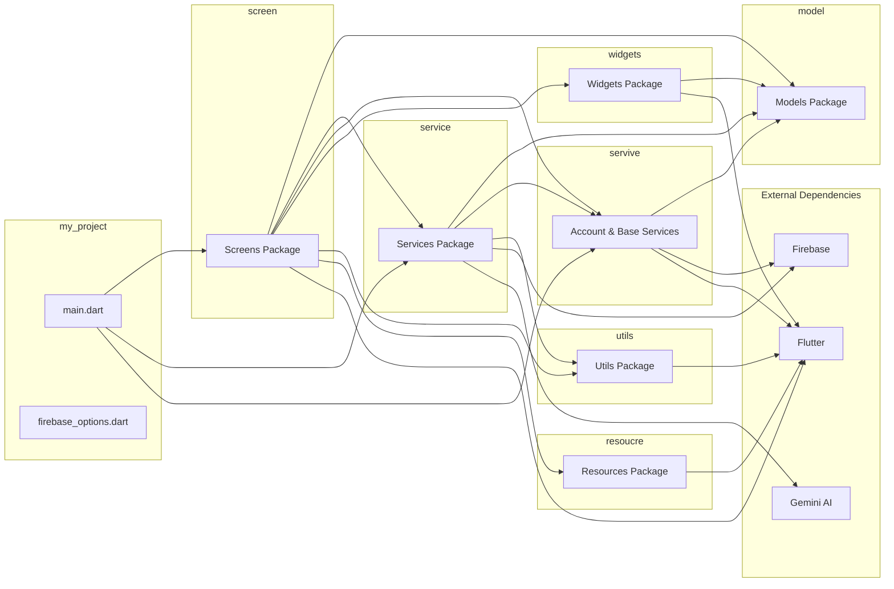

# Class Diagram - Belly Bloom App (Ứng dụng Chăm sóc Thai kỳ)

## Tổng quan dự án

Đây là ứng dụng Flutter chăm sóc thai kỳ với các tính năng chính:

- Quản lý lịch hẹn khám bệnh
- Nhật ký thai kỳ
- Cẩm nang và bài tập
- Theo dõi sức khỏe
- Chat với AI (Gemini)
- Thông báo nhắc nhở

## Kiến trúc tổng quan

Dự án được tổ chức theo kiến trúc 3 lớp:

1. **Models Layer** (`lib/model/`): Các lớp dữ liệu
2. **Services Layer** (`lib/service/` và `lib/servive/`): Logic nghiệp vụ
3. **UI Layer** (`lib/screen/` và `lib/widgets/`): Giao diện người dùng

## Class Diagram (Mermaid)

```mermaid
classDiagram
    %% ============================================
    %% MODELS LAYER
    %% ============================================

    class UserAccount {
        +String name
        +String email
        +FormCollection? formCollection
        +String? uid
        +fromJson()
        +toJson()
        +copyWith()
    }

    class FormCollection {
        +int id
        +double height
        +int weight
        +int week
        +DateTime createdAt
        +DateTime lastestUpdate
        +fromJson()
        +toJson()
    }

    class Appointment {
        +String? id
        +String title
        +String description
        +DateTime dateTime
        +String? location
        +AppointmentType type
        +bool isReminder
        +int reminderMinutes
        +String? doctorName
        +String? notes
        +DateTime createdAt
        +DateTime updatedAt
        +fromJson()
        +toJson()
        +get typeDisplayName
        +get isToday
        +get isPast
        +get isUpcoming
    }

    class AppointmentType {
        <<enumeration>>
        KHAM_BENH
        NHAC_NHO
        KHAC
    }

    class DiaryModel {
        +String? id
        +String userId
        +DateTime date
        +String content
        +List~String~ imageUrls
        +DateTime createdAt
        +DateTime updatedAt
        +fromJson()
        +toJson()
        +get formattedDate
        +get dayOfWeek
        +get isToday
        +get isYesterday
        +get relativeDate
    }

    class BlogModel {
        +String? id
        +String title
        +String subtitle
        +String content
        +String imageUrl
        +DateTime createdAt
        +DateTime updatedAt
        +List~int~ targetWeeks
        +fromJson()
        +toJson()
        +isForWeek()
    }

    class ExerciseModel {
        +String? id
        +String title
        +String description
        +String content
        +String imageUrl
        +String category
        +String difficulty
        +int duration
        +List~String~ benefits
        +List~String~ precautions
        +List~String~ equipment
        +List~String~ instructions
        +List~String~ targetWeeks
        +bool isActive
        +DateTime createdAt
        +DateTime updatedAt
        +fromJson()
        +toJson()
        +get categoryDisplayName
        +get difficultyDisplayName
        +isSuitableForWeek()
    }

    class HealthMetricModel {
        +String? id
        +String userId
        +DateTime date
        +double? weight
        +double? height
        +double? bloodPressureSystolic
        +double? bloodPressureDiastolic
        +int? heartRate
        +String? notes
        +DateTime createdAt
        +DateTime updatedAt
        +fromJson()
        +toJson()
        +copyWith()
    }

    class ReminderModel {
        +String? id
        +int weekNumber
        +String title
        +String description
        +String priority
        +bool isActive
        +DateTime createdAt
        +DateTime updatedAt
        +fromJson()
        +toJson()
        +get priorityDisplayName
        +get priorityColor
    }

    class HandBook {
        +int id
        +String title
        +String content
    }

    %% ============================================
    %% SERVICES LAYER
    %% ============================================

    class AppointmentService {
        +{static} getAppointments()
        +{static} getAppointmentsByType()
        +{static} addAppointment()
        +{static} updateAppointment()
        +{static} deleteAppointment()
        +{static} getUpcomingAppointments()
        +{static} searchAppointments()
    }

    class DiaryService {
        +{static} getDiaries()
        +{static} getDiaryForDate()
        +{static} uploadImage()
        +{static} uploadImages()
        +{static} deleteImage()
        +{static} addDiary()
        +{static} updateDiary()
        +{static} deleteDiary()
        +{static} saveDiary()
        +{static} removeImageFromDiary()
    }

    class BlogService {
        +{static} loadBlogs()
        +{static} loadBlogsForWeek()
        +{static} searchBlogs()
    }

    class ExerciseService {
        +{static} loadExercises()
        +{static} loadExercisesForWeek()
        +{static} loadExercisesByCategory()
        +{static} loadExercisesByDifficulty()
        +{static} searchExercises()
    }

    class HealthMetricService {
        +{static} saveHealthMetric()
        +{static} getHealthMetrics()
        +{static} getHealthMetricForDate()
        +{static} deleteHealthMetric()
    }

    class ReminderService {
        +{static} loadReminders()
        +{static} loadRemindersByWeek()
    }

    class AccountService {
        +{static} login()
        +{static} getUserAccount()
        +{static} updateUserCollectionForm()
        +{static} logout()
        +{static} updateUserInfo()
        +{static} updateUserAndFormCollection()
    }

    class NotificationService {
        +{static} initialize()
        +{static} scheduleAppointmentNotification()
        +{static} cancelAppointmentNotification()
        +{static} cancelAllAppointmentNotifications()
        +{static} rescheduleAllAppointments()
        +{static} showTestNotification()
    }

    class GeminiService {
        +{static} initialize()
        +{static} analyzeIntent()
        +{static} handleIntent()
        +{static} _getSystemPrompt()
        +{static} _fallbackIntentAnalysis()
        +{static} _handleUpcomingAppointments()
        +{static} _handleCurrentWeek()
        +{static} _handleExercises()
        +{static} _handleBlogs()
        +{static} _handleGeneralChat()
    }

    class ChatIntent {
        +String intent
        +String action
        +int? week
    }

    class BaseCommon {
        -{static} BaseCommon _instance
        +SharedPreferences prefs
        +UserAccount userAccount
        +{static} BaseCommon()
        +initBaseCommon()
        +saveUserAccount()
        +saveAutoLogin()
        +checkLogin()
        +clearUserAccount()
    }

    %% ============================================
    %% RELATIONSHIPS
    %% ============================================

    UserAccount "1" *-- "0..1" FormCollection : contains
    Appointment "1" --> "*" AppointmentType : uses

    AppointmentService ..> Appointment : manages
    AppointmentService ..> BaseCommon : uses
    AppointmentService ..> NotificationService : uses

    DiaryService ..> DiaryModel : manages
    DiaryService ..> BaseCommon : uses

    BlogService ..> BlogModel : manages

    ExerciseService ..> ExerciseModel : manages

    HealthMetricService ..> HealthMetricModel : manages

    ReminderService ..> ReminderModel : manages

    AccountService ..> UserAccount : manages
    AccountService ..> FormCollection : manages

    NotificationService ..> Appointment : uses
    NotificationService ..> AppointmentService : uses

    GeminiService ..> ChatIntent : uses
    GeminiService ..> AppointmentService : uses
    GeminiService ..> BlogService : uses
    GeminiService ..> ExerciseService : uses
    GeminiService ..> BaseCommon : uses

    BaseCommon ..> UserAccount : contains
    BaseCommon ..> AccountService : uses
```

## Mô tả chi tiết các lớp

### 1. Models Layer

#### UserAccount

- **Mục đích**: Đại diện cho tài khoản người dùng
- **Thuộc tính chính**: name, email, formCollection, uid
- **Quan hệ**: Chứa một FormCollection (optional)

#### FormCollection

- **Mục đích**: Lưu thông tin thai kỳ của người dùng
- **Thuộc tính chính**: height, weight, week, createdAt
- **Quan hệ**: Được chứa trong UserAccount

#### Appointment

- **Mục đích**: Đại diện cho lịch hẹn khám bệnh hoặc nhắc nhở
- **Thuộc tính chính**: title, description, dateTime, type, isReminder
- **Enum**: AppointmentType (KHAM_BENH, NHAC_NHO, KHAC)
- **Methods đặc biệt**: isToday, isPast, isUpcoming

#### DiaryModel

- **Mục đích**: Nhật ký thai kỳ với hình ảnh
- **Thuộc tính chính**: date, content, imageUrls
- **Methods đặc biệt**: formattedDate, relativeDate

#### BlogModel

- **Mục đích**: Cẩm nang thai kỳ
- **Thuộc tính chính**: title, subtitle, content, imageUrl, targetWeeks
- **Methods đặc biệt**: isForWeek() - kiểm tra blog phù hợp với tuần thai

#### ExerciseModel

- **Mục đích**: Bài tập thể dục cho thai phụ
- **Thuộc tính chính**: title, category, difficulty, duration, targetWeeks
- **Methods đặc biệt**: isSuitableForWeek()

#### HealthMetricModel

- **Mục đích**: Chỉ số sức khỏe (cân nặng, huyết áp, nhịp tim)
- **Thuộc tính chính**: weight, height, bloodPressure, heartRate

#### ReminderModel

- **Mục đích**: Nhắc nhở theo tuần thai
- **Thuộc tính chính**: weekNumber, title, description, priority

### 2. Services Layer

#### AppointmentService

- **Chức năng**: CRUD cho Appointment
- **Đặc biệt**: Tích hợp với NotificationService để tạo thông báo

#### DiaryService

- **Chức năng**: CRUD cho DiaryModel
- **Đặc biệt**: Quản lý upload/delete hình ảnh lên Firebase Storage

#### BlogService

- **Chức năng**: Load và tìm kiếm blogs
- **Đặc biệt**: Filter blogs theo tuần thai

#### ExerciseService

- **Chức năng**: Load và tìm kiếm exercises
- **Đặc biệt**: Filter theo tuần, category, difficulty

#### HealthMetricService

- **Chức năng**: CRUD cho HealthMetricModel
- **Đặc biệt**: Lấy metrics theo ngày

#### ReminderService

- **Chức năng**: Load reminders
- **Đặc biệt**: Filter theo tuần thai

#### AccountService

- **Chức năng**: Quản lý authentication và user account
- **Đặc biệt**: Tích hợp Firebase Auth và Firestore

#### NotificationService

- **Chức năng**: Quản lý thông báo local
- **Đặc biệt**: Schedule notifications cho appointments

#### GeminiService

- **Chức năng**: Chat AI với Gemini API
- **Đặc biệt**:
  - Phân tích intent từ câu hỏi
  - Tích hợp với các services khác để lấy dữ liệu
  - Hỗ trợ nhiều intent: appointments, exercises, blogs, current_week

### 3. Base/Common Layer

#### BaseCommon

- **Pattern**: Singleton
- **Chức năng**: Quản lý state toàn cục
- **Đặc biệt**:
  - Lưu UserAccount hiện tại
  - Quản lý SharedPreferences
  - Auto-login

## Luồng dữ liệu chính

### 1. Authentication Flow

```
User → AccountService.login() → FirebaseAuth → Firestore → UserAccount → BaseCommon
```

### 2. Appointment Flow

```
UI → AppointmentService.addAppointment() → Firestore → NotificationService.scheduleNotification()
```

### 3. Diary Flow

```
UI → DiaryService.saveDiary() → FirebaseStorage (upload images) → Firestore
```

### 4. Chat AI Flow

```
User Message → GeminiService.analyzeIntent() → ChatIntent → GeminiService.handleIntent() →
  → AppointmentService/BlogService/ExerciseService → Response
```

## Công nghệ sử dụng

- **Firebase**:

  - Firestore (Database)
  - Firebase Auth (Authentication)
  - Firebase Storage (File storage)
  - Firebase Messaging (Push notifications)

- **Flutter Packages**:
  - flutter_local_notifications (Local notifications)
  - google_generative_ai (Gemini AI)
  - shared_preferences (Local storage)
  - provider (State management)

## Ghi chú

1. **Naming Convention**: Có một số inconsistency trong tên thư mục (`service` vs `servive`)
2. **Legacy Models**: Có một số model cũ (Diary, MyNote, NearSchedule) có thể không còn sử dụng
3. **Singleton Pattern**: BaseCommon sử dụng Singleton pattern để quản lý global state
4. **Static Services**: Tất cả services đều sử dụng static methods, không cần instantiate

## Cách xem Class Diagram

1. **PlantUML**: Mở file `CLASS_DIAGRAM.puml` bằng PlantUML viewer
2. **Mermaid**: Copy nội dung trong `CLASS_DIAGRAM.md` vào Mermaid viewer online
3. **VS Code**: Cài extension PlantUML hoặc Mermaid để preview

---

# Package Diagram - Belly Bloom App

## Tổng quan Package Structure

Package diagram thể hiện cấu trúc thư mục và mối quan hệ phụ thuộc giữa các package trong dự án.

## Package Diagram (Mermaid)

```mermaid
graph TB
    subgraph "Core"
        Main[main.dart]
        FirebaseOptions[firebase_options.dart]
    end

    subgraph "Models Package"
        Models[model/]
        Models --> Appointment[Appointment]
        Models --> BlogModel[BlogModel]
        Models --> DiaryModel[DiaryModel]
        Models --> ExerciseModel[ExerciseModel]
        Models --> HealthMetricModel[HealthMetricModel]
        Models --> ReminderModel[ReminderModel]
        Models --> UserAccount[UserAccount]
        Models --> FormCollection[FormCollection]
    end

    subgraph "Services Package"
        Service[service/]
        Service --> AppointmentService[AppointmentService]
        Service --> BlogService[BlogService]
        Service --> DiaryService[DiaryService]
        Service --> ExerciseService[ExerciseService]
        Service --> GeminiService[GeminiService]
        Service --> HealthMetricService[HealthMetricService]
        Service --> NotificationService[NotificationService]
        Service --> ReminderService[ReminderService]
    end

    subgraph "Service Package (Alternative)"
        Servive[servive/]
        Servive --> AccountService[AccountService]
        Servive --> BaseCommon[BaseCommon]
    end

    subgraph "UI Package - Screens"
        Screen[screen/]
        Screen --> AuthScreens[Authentication Screens]
        Screen --> MainScreens[Main Screens]
        Screen --> FeatureScreens[Feature Screens]
        Screen --> FormCollectionScreens[Form Collection]
    end

    subgraph "UI Package - Widgets"
        Widgets[widgets/]
        Widgets --> AppointmentCard[AppointmentCard]
        Widgets --> BlogCard[BlogCard]
        Widgets --> DiaryCard[DiaryCard]
        Widgets --> ExerciseCard[ExerciseCard]
    end

    subgraph "Utils Package"
        Utils[utils/]
        Utils --> UtilsCommon[UtilsCommon]
    end

    subgraph "Resources Package"
        Resources[resoucre/]
        Resources --> ColorManager[ColorManager]
        Resources --> ImageManager[ImageManager]
        Resources --> ResponsiveUtils[ResponsiveUtils]
    end

    subgraph "External - Firebase"
        Firebase[Firebase]
        Firebase --> FirebaseCore[firebase_core]
        Firebase --> FirebaseAuth[firebase_auth]
        Firebase --> Firestore[cloud_firestore]
        Firebase --> FirebaseStorage[firebase_storage]
        Firebase --> FirebaseMessaging[firebase_messaging]
    end

    subgraph "External - Flutter"
        Flutter[Flutter Packages]
        Flutter --> FlutterLocalNotifications[flutter_local_notifications]
        Flutter --> SharedPreferences[shared_preferences]
    end

    subgraph "External - AI"
        AI[google_generative_ai]
    end

    %% Dependencies
    Main --> Screen
    Main --> Service
    Main --> Servive
    Main --> FirebaseOptions

    Service --> Models
    Service --> Servive
    Service --> Utils
    Service --> Firebase
    Service --> AI

    Servive --> Models
    Servive --> Firebase
    Servive --> Flutter

    Screen --> Models
    Screen --> Service
    Screen --> Servive
    Screen --> Widgets
    Screen --> Utils
    Screen --> Resources
    Screen --> Flutter

    Widgets --> Models
    Widgets --> Flutter

    Utils --> Flutter
    Resources --> Flutter

    %% Specific service dependencies
    AppointmentService -.-> NotificationService
    GeminiService -.-> AppointmentService
    GeminiService -.-> BlogService
    GeminiService -.-> ExerciseService
    GeminiService -.-> Servive

    DiaryService -.-> FirebaseStorage

    NotificationService -.-> FlutterLocalNotifications

    AccountService -.-> FirebaseAuth
    AccountService -.-> Firestore

    BaseCommon -.-> AccountService
    BaseCommon -.-> SharedPreferences

    style Main fill:#ffcccc
    style Models fill:#cce5ff
    style Service fill:#ccffcc
    style Servive fill:#ccffcc
    style Screen fill:#ffffcc
    style Widgets fill:#ffffcc
    style Utils fill:#e0e0e0
    style Resources fill:#e0e0e0
    style Firebase fill:#ffcccc
    style Flutter fill:#ffcccc
    style AI fill:#ffcccc
```



## Package Diagram (PlantUML Style)



## Mô tả các Package

### 1. Core Package (`lib/`)

- **main.dart**: Entry point của ứng dụng, khởi tạo Firebase và MaterialApp
- **firebase_options.dart**: Cấu hình Firebase cho các platform

### 2. Models Package (`lib/model/`)

- **Mục đích**: Chứa tất cả các data models
- **Các class chính**:
  - Appointment, BlogModel, DiaryModel, ExerciseModel
  - HealthMetricModel, ReminderModel
  - UserAccount, FormCollection
- **Dependencies**: Firebase (cho Timestamp)

### 3. Services Package (`lib/service/`)

- **Mục đích**: Business logic layer
- **Các service chính**:
  - `AppointmentService`: CRUD appointments
  - `DiaryService`: CRUD diaries + image upload
  - `BlogService`: Load và search blogs
  - `ExerciseService`: Load và search exercises
  - `HealthMetricService`: CRUD health metrics
  - `ReminderService`: Load reminders
  - `NotificationService`: Local notifications
  - `GeminiService`: AI chat service
- **Dependencies**: Models, Utils, Firebase, AI

### 4. Service Package (`lib/servive/`)

- **Lưu ý**: Có typo trong tên thư mục (nên là "service")
- **Mục đích**: Account management và base common
- **Các class**:
  - `AccountService`: Authentication và user management
  - `BaseCommon`: Singleton cho global state
- **Dependencies**: Models, Firebase, Flutter

### 5. Screen Package (`lib/screen/`)

- **Mục đích**: UI screens (pages)
- **Các nhóm screen**:
  - **Authentication**: LoginPage, RegisterPage, SignInPage, SplashPage
  - **Main**: HomePage, AccountPage, ProfilePage, SettingPages
  - **Features**:
    - AppointmentPage, AppointmentFormPage
    - DiaryPage, DiaryFormPage, DiaryDetailPage
    - BlogDetailPage, ExerciseDetailPage
    - GuidePage, HandbookDetailPage
    - SchedulePage, ProgressChartPage
    - ChatPage, TextNodePage
  - **Form Collection**: CollectionCalendar, CollectionHeight, CollectionWeight
  - **Tabs**: FormCollectionTitle, TabHomePage
- **Dependencies**: Models, Services, Widgets, Utils, Resources, Flutter

### 6. Widgets Package (`lib/widgets/`)

- **Mục đích**: Reusable UI components
- **Các widget**:
  - AppointmentCard, AppointmentDialog
  - BlogCard, DiaryCard, ExerciseCard
  - HealthMetricDialog
- **Dependencies**: Models, Flutter

### 7. Utils Package (`lib/utils/`)

- **Mục đích**: Utility functions
- **Class**: UtilsCommon (helper functions)
- **Dependencies**: Flutter

### 8. Resources Package (`lib/resoucre/`)

- **Lưu ý**: Có typo trong tên thư mục (nên là "resource")
- **Mục đích**: Resources và constants
- **Các class**:
  - ColorManager: Màu sắc
  - ImageManager: Quản lý images
  - ResponsiveUtils: Responsive utilities
- **Dependencies**: Flutter

## Dependency Flow

### Dependency Hierarchy (Top to Bottom)

```
┌─────────────────┐
│   UI Layer      │  (screen, widgets)
│   (Dependent)   │
└────────┬────────┘
         │
         ▼
┌─────────────────┐
│  Service Layer  │  (service, servive)
│   (Business)    │
└────────┬────────┘
         │
         ▼
┌─────────────────┐
│  Models Layer   │  (model)
│    (Data)       │
└────────┬────────┘
         │
         ▼
┌─────────────────┐
│   External      │  (Firebase, Flutter, AI)
│  Dependencies   │
└─────────────────┘
```

### Dependency Rules

1. **UI Layer** phụ thuộc vào:

   - Service Layer
   - Models Layer
   - Utils & Resources
   - Flutter

2. **Service Layer** phụ thuộc vào:

   - Models Layer
   - Utils
   - External (Firebase, AI)

3. **Models Layer** phụ thuộc vào:

   - External (Firebase - cho Timestamp)

4. **Không có circular dependencies**: Kiến trúc tuân thủ nguyên tắc dependency inversion

## Package Dependencies Matrix

| Package     | Depends On                                                 |
| ----------- | ---------------------------------------------------------- |
| `main.dart` | screen, service, servive, Firebase                         |
| `screen/`   | model, service, servive, widgets, utils, resoucre, Flutter |
| `widgets/`  | model, Flutter                                             |
| `service/`  | model, servive, utils, Firebase, AI                        |
| `servive/`  | model, Firebase, Flutter                                   |
| `model/`    | Firebase                                                   |
| `utils/`    | Flutter                                                    |
| `resoucre/` | Flutter                                                    |

## External Dependencies

### Firebase Packages

- `firebase_core`: Core Firebase functionality
- `firebase_auth`: Authentication
- `cloud_firestore`: NoSQL database
- `firebase_storage`: File storage
- `firebase_messaging`: Push notifications

### Flutter Packages

- `flutter_local_notifications`: Local notifications
- `shared_preferences`: Local storage
- `provider`: State management
- `flutter_quill`: Rich text editor
- `fl_chart`: Charts
- `table_calendar`: Calendar widget

### AI Packages

- `google_generative_ai`: Gemini AI integration

## Cách xem Package Diagram

1. **PlantUML**: Mở file `PACKAGE_DIAGRAM.puml` bằng PlantUML viewer
2. **Mermaid**: Xem trong file markdown này hoặc copy vào Mermaid Live Editor
3. **VS Code**: Cài extension PlantUML hoặc Mermaid để preview

## Ghi chú về Package Structure

1. **Naming Inconsistencies**:

   - `servive/` nên là `service/`
   - `resoucre/` nên là `resource/`
   - `reponsive.dart` nên là `responsive.dart`

2. **Package Organization**:

   - Có thể gộp `service/` và `servive/` thành một package
   - Có thể tách `screen/` thành các sub-packages theo feature

3. **Dependency Management**:
   - Tất cả dependencies đều đi từ trên xuống dưới (không có circular)
   - Services không phụ thuộc vào UI (tốt cho testing)
