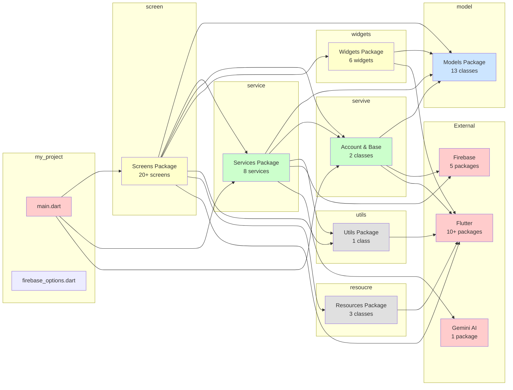

# Package Diagram - Belly Bloom App

## Tổng quan Package Structure

Package diagram thể hiện cấu trúc thư mục và mối quan hệ phụ thuộc giữa các package trong dự án Flutter.

## Package Diagram (Mermaid)

```mermaid
graph TB
    subgraph "Core"
        Main[main.dart]
        FirebaseOptions[firebase_options.dart]
    end
    
    subgraph "Models Package"
        Models[model/]
        Models --> Appointment[Appointment]
        Models --> BlogModel[BlogModel]
        Models --> DiaryModel[DiaryModel]
        Models --> ExerciseModel[ExerciseModel]
        Models --> HealthMetricModel[HealthMetricModel]
        Models --> ReminderModel[ReminderModel]
        Models --> UserAccount[UserAccount]
        Models --> FormCollection[FormCollection]
    end
    
    subgraph "Services Package"
        Service[service/]
        Service --> AppointmentService[AppointmentService]
        Service --> BlogService[BlogService]
        Service --> DiaryService[DiaryService]
        Service --> ExerciseService[ExerciseService]
        Service --> GeminiService[GeminiService]
        Service --> HealthMetricService[HealthMetricService]
        Service --> NotificationService[NotificationService]
        Service --> ReminderService[ReminderService]
    end
    
    subgraph "Service Package (Alternative)"
        Servive[servive/]
        Servive --> AccountService[AccountService]
        Servive --> BaseCommon[BaseCommon]
    end
    
    subgraph "UI Package - Screens"
        Screen[screen/]
        Screen --> AuthScreens[Authentication Screens]
        Screen --> MainScreens[Main Screens]
        Screen --> FeatureScreens[Feature Screens]
        Screen --> FormCollectionScreens[Form Collection]
    end
    
    subgraph "UI Package - Widgets"
        Widgets[widgets/]
        Widgets --> AppointmentCard[AppointmentCard]
        Widgets --> BlogCard[BlogCard]
        Widgets --> DiaryCard[DiaryCard]
        Widgets --> ExerciseCard[ExerciseCard]
    end
    
    subgraph "Utils Package"
        Utils[utils/]
        Utils --> UtilsCommon[UtilsCommon]
    end
    
    subgraph "Resources Package"
        Resources[resoucre/]
        Resources --> ColorManager[ColorManager]
        Resources --> ImageManager[ImageManager]
        Resources --> ResponsiveUtils[ResponsiveUtils]
    end
    
    subgraph "External - Firebase"
        Firebase[Firebase]
        Firebase --> FirebaseCore[firebase_core]
        Firebase --> FirebaseAuth[firebase_auth]
        Firebase --> Firestore[cloud_firestore]
        Firebase --> FirebaseStorage[firebase_storage]
        Firebase --> FirebaseMessaging[firebase_messaging]
    end
    
    subgraph "External - Flutter"
        Flutter[Flutter Packages]
        Flutter --> FlutterLocalNotifications[flutter_local_notifications]
        Flutter --> SharedPreferences[shared_preferences]
    end
    
    subgraph "External - AI"
        AI[google_generative_ai]
    end
    
    %% Dependencies
    Main --> Screen
    Main --> Service
    Main --> Servive
    Main --> FirebaseOptions
    
    Service --> Models
    Service --> Servive
    Service --> Utils
    Service --> Firebase
    Service --> AI
    
    Servive --> Models
    Servive --> Firebase
    Servive --> Flutter
    
    Screen --> Models
    Screen --> Service
    Screen --> Servive
    Screen --> Widgets
    Screen --> Utils
    Screen --> Resources
    Screen --> Flutter
    
    Widgets --> Models
    Widgets --> Flutter
    
    Utils --> Flutter
    Resources --> Flutter
    
    %% Specific service dependencies
    AppointmentService -.-> NotificationService
    GeminiService -.-> AppointmentService
    GeminiService -.-> BlogService
    GeminiService -.-> ExerciseService
    GeminiService -.-> Servive
    
    DiaryService -.-> FirebaseStorage
    
    NotificationService -.-> FlutterLocalNotifications
    
    AccountService -.-> FirebaseAuth
    AccountService -.-> Firestore
    
    BaseCommon -.-> AccountService
    BaseCommon -.-> SharedPreferences
    
    style Main fill:#ffcccc
    style Models fill:#cce5ff
    style Service fill:#ccffcc
    style Servive fill:#ccffcc
    style Screen fill:#ffffcc
    style Widgets fill:#ffffcc
    style Utils fill:#e0e0e0
    style Resources fill:#e0e0e0
    style Firebase fill:#ffcccc
    style Flutter fill:#ffcccc
    style AI fill:#ffcccc
```



## Package Diagram - Simplified View



## Cấu trúc Package Chi tiết

### 1. Core Package (`lib/`)

#### main.dart
- **Vai trò**: Entry point của ứng dụng
- **Chức năng**:
  - Khởi tạo Firebase
  - Setup notifications
  - Khởi tạo BaseCommon
  - Tạo MaterialApp với SplashPage

#### firebase_options.dart
- **Vai trò**: Cấu hình Firebase cho các platform
- **Generated**: Tự động generate bởi FlutterFire CLI

### 2. Models Package (`lib/model/`)

**13 classes** chứa data models:

| Class | Mô tả |
|-------|-------|
| `Appointment` | Lịch hẹn khám bệnh/nhắc nhở |
| `BlogModel` | Cẩm nang thai kỳ |
| `DiaryModel` | Nhật ký thai kỳ |
| `ExerciseModel` | Bài tập thể dục |
| `HealthMetricModel` | Chỉ số sức khỏe |
| `ReminderModel` | Nhắc nhở theo tuần |
| `UserAccount` | Tài khoản người dùng |
| `FormCollection` | Thông tin thai kỳ |
| `HandBook` | Sổ tay hướng dẫn |
| `Diary` | Legacy model |
| `MyNote` | Legacy model |
| `NearSchedule` | Legacy model |
| `WelcomeModel` | Model cho welcome screen |

### 3. Services Package (`lib/service/`)

**8 services** xử lý business logic:

| Service | Chức năng |
|---------|-----------|
| `AppointmentService` | CRUD appointments, tìm kiếm |
| `BlogService` | Load blogs, filter theo tuần |
| `DiaryService` | CRUD diaries, upload images |
| `ExerciseService` | Load exercises, filter theo tuần/category |
| `GeminiService` | AI chat, phân tích intent |
| `HealthMetricService` | CRUD health metrics |
| `NotificationService` | Local notifications |
| `ReminderService` | Load reminders theo tuần |

### 4. Service Package (`lib/servive/`)

**2 classes** quản lý account và base:

| Class | Chức năng |
|-------|-----------|
| `AccountService` | Authentication, user management |
| `BaseCommon` | Singleton cho global state |

**Lưu ý**: Tên thư mục có typo (`servive` thay vì `service`)

### 5. Screen Package (`lib/screen/`)

**20+ screens** được tổ chức theo nhóm:

#### Authentication & Onboarding
- `SplashPage`: Màn hình splash
- `LoginPage`: Đăng nhập
- `RegisterPage`: Đăng ký
- `SignInPage`: Đăng nhập (alternative)
- `WelcomePage`: Onboarding

#### Main Screens
- `HomePage`: Trang chủ
- `AccountPage`: Tài khoản
- `ProfilePage`: Hồ sơ
- `SettingPages`: Cài đặt

#### Feature Screens
- **Appointments**: `AppointmentPage`, `AppointmentFormPage`
- **Diary**: `DiaryPage`, `DiaryFormPage`, `DiaryDetailPage`
- **Content**: `BlogDetailPage`, `ExerciseDetailPage`, `GuidePage`, `HandbookDetailPage`
- **Tracking**: `SchedulePage`, `ProgressChartPage`
- **AI**: `ChatPage`, `TextNodePage`

#### Sub-packages
- `form_collection/`: CollectionCalendar, CollectionHeight, CollectionWeight
- `tab/`: FormCollectionTitle, TabHomePage
- `onBoard/`: Welcome

### 6. Widgets Package (`lib/widgets/`)

**6 reusable widgets**:

| Widget | Mô tả |
|--------|-------|
| `AppointmentCard` | Card hiển thị appointment |
| `AppointmentDialog` | Dialog cho appointment |
| `BlogCard` | Card hiển thị blog |
| `DiaryCard` | Card hiển thị diary |
| `ExerciseCard` | Card hiển thị exercise |
| `HealthMetricDialog` | Dialog cho health metric |

### 7. Utils Package (`lib/utils/`)

**1 class**:
- `UtilsCommon`: Helper functions (tính tuần thai, ngày dự sinh, etc.)

### 8. Resources Package (`lib/resoucre/`)

**3 classes** quản lý resources:

| Class | Chức năng |
|-------|-----------|
| `ColorManager` | Quản lý màu sắc |
| `ImageManager` | Quản lý hình ảnh |
| `ResponsiveUtils` | Responsive utilities |

**Lưu ý**: Tên thư mục có typo (`resoucre` thay vì `resource`)

## Dependency Flow

### Dependency Hierarchy

```
┌─────────────────────────────────┐
│         UI Layer                │
│  (screen, widgets)              │
│  [Dependent on all below]       │
└────────────┬────────────────────┘
             │
             ▼
┌─────────────────────────────────┐
│      Service Layer              │
│  (service, servive)             │
│  [Business Logic]                │
└────────────┬────────────────────┘
             │
             ▼
┌─────────────────────────────────┐
│       Models Layer              │
│  (model)                        │
│  [Data Models]                  │
└────────────┬────────────────────┘
             │
             ▼
┌─────────────────────────────────┐
│    External Dependencies       │
│  (Firebase, Flutter, AI)        │
└─────────────────────────────────┘
```

### Dependency Rules

1. **UI Layer** → Service Layer, Models, Utils, Resources, Flutter
2. **Service Layer** → Models, Utils, External (Firebase, AI)
3. **Models Layer** → External (Firebase - cho Timestamp)
4. **No Circular Dependencies**: Kiến trúc tuân thủ dependency inversion

## Package Dependencies Matrix

| Package | Depends On | Used By |
|--------|-----------|---------|
| `main.dart` | screen, service, servive, Firebase | - |
| `screen/` | model, service, servive, widgets, utils, resoucre, Flutter | main |
| `widgets/` | model, Flutter | screen |
| `service/` | model, servive, utils, Firebase, AI | screen, main |
| `servive/` | model, Firebase, Flutter | service, screen, main |
| `model/` | Firebase | service, servive, screen, widgets |
| `utils/` | Flutter | service, screen |
| `resoucre/` | Flutter | screen |

## External Dependencies

### Firebase Packages
- `firebase_core` ^4.1.1
- `firebase_auth` ^6.1.0
- `cloud_firestore` ^6.0.2
- `firebase_storage` ^13.0.3
- `firebase_messaging` ^16.0.4

### Flutter Packages
- `flutter_local_notifications` ^18.0.0
- `shared_preferences` ^2.5.3
- `provider` ^6.1.1
- `flutter_quill` ^11.5.0
- `fl_chart` ^0.69.0
- `table_calendar` ^3.1.2
- `numberpicker` ^2.1.2
- `file_picker` ^8.0.6
- `timezone` ^0.9.2
- `http` ^1.5.0

### AI Packages
- `google_generative_ai` ^0.4.0

## Cách xem Package Diagram

1. **PlantUML**: Mở file `PACKAGE_DIAGRAM.puml` bằng PlantUML viewer
2. **Mermaid**: Xem trong file này hoặc copy vào [Mermaid Live Editor](https://mermaid.live)
3. **VS Code**: Cài extension PlantUML hoặc Mermaid để preview

## Ghi chú và Cải tiến

### Issues cần lưu ý

1. **Naming Inconsistencies**: 
   - `servive/` → nên đổi thành `service/`
   - `resoucre/` → nên đổi thành `resource/`
   - `reponsive.dart` → nên đổi thành `responsive.dart`

2. **Package Organization**: 
   - Có thể gộp `service/` và `servive/` thành một package
   - Có thể tách `screen/` thành các sub-packages theo feature:
     - `screen/auth/`
     - `screen/appointment/`
     - `screen/diary/`
     - `screen/content/`
     - etc.

3. **Dependency Management**: 
   - Hiện tại: Tất cả dependencies đều đi từ trên xuống (tốt)
   - Services không phụ thuộc vào UI (tốt cho testing)
   - Có thể thêm interface/abstraction layer để dễ test hơn

### Best Practices

1. ✅ **Separation of Concerns**: Models, Services, UI tách biệt rõ ràng
2. ✅ **No Circular Dependencies**: Kiến trúc tuân thủ dependency inversion
3. ✅ **Reusability**: Widgets package cho reusable components
4. ⚠️ **Naming**: Cần sửa các typo trong tên thư mục
5. ⚠️ **Organization**: Có thể tổ chức lại screen package theo feature

